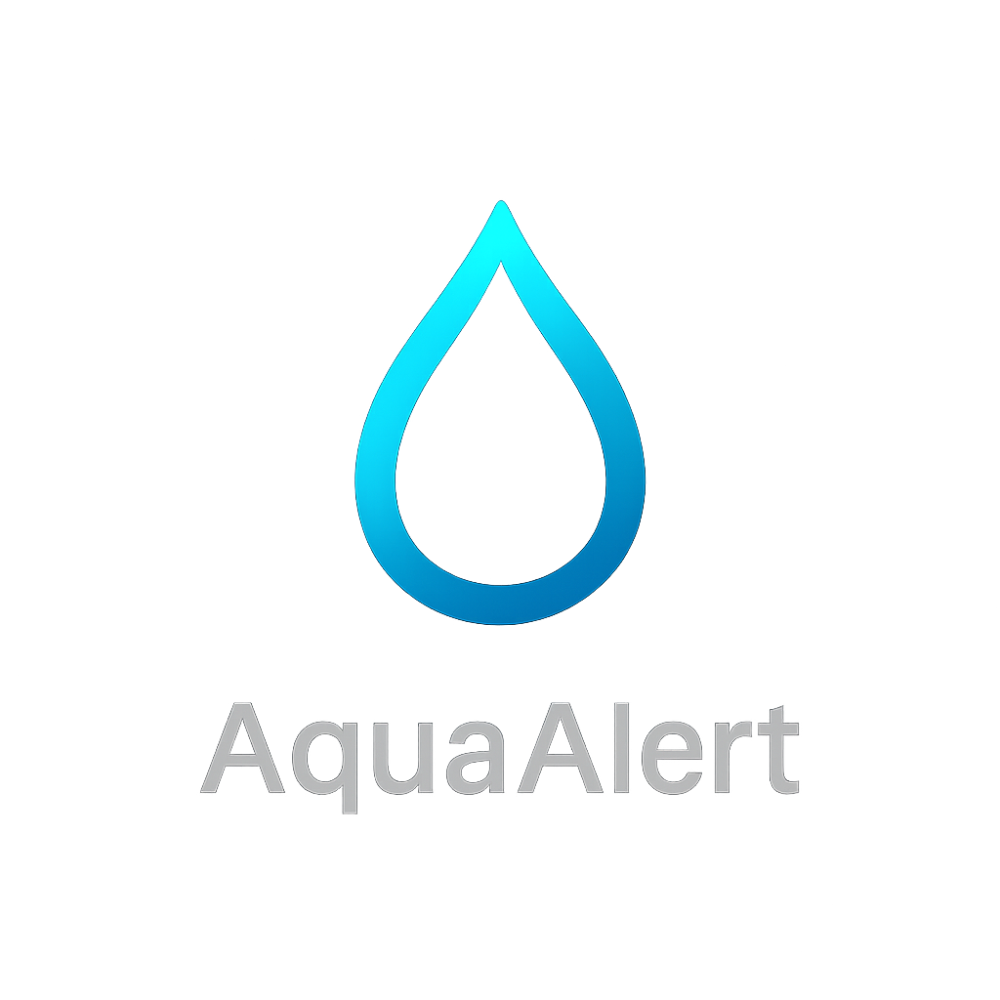

# Aqua Alert 💧

A modern water intake tracking application that helps you stay hydrated with smart reminders, personalized goals, and seamless tracking across all your devices.



## 🌟 Features

- **Smart Reminders**: Intelligent notifications that adapt to your schedule
- **Personalized Goals**: Custom hydration targets based on your lifestyle and activity level
- **Cross-Device Sync**: Real-time synchronization across all your devices with cloud backup
- **Anonymous Mode**: Track your hydration without creating an account
- **Modern UI**: Beautiful, responsive design with smooth animations
- **Secure Authentication**: JWT-based authentication for registered users

## 🏗️ Architecture

This project follows a modern full-stack architecture:

- **Frontend**: React with Vite, TailwindCSS, and Lucide React icons
- **Backend**: Node.js with Express and MongoDB
- **Authentication**: JWT tokens with bcrypt password hashing
- **Database**: MongoDB with Mongoose ODM
- **Styling**: TailwindCSS with custom design system

## 📁 Project Structure

```
aqua-alert/
├── frontend/                 # React frontend application
│   ├── src/
│   │   ├── components/      # Reusable UI components
│   │   │   └── ui/         # shadcn/ui components
│   │   ├── pages/          # Page components
│   │   ├── lib/            # Utility functions
│   │   └── assets/         # Static assets
│   ├── public/             # Public assets
│   └── package.json
└── backend/                 # Express backend API
    ├── controllers/        # Request handlers
    ├── models/            # Database models
    ├── routes/            # API routes
    ├── services/          # Business logic
    ├── middlewares/       # Custom middleware
    └── package.json
```

## 🚀 Getting Started

### Prerequisites

- Node.js (v16 or higher)
- MongoDB (local or MongoDB Atlas)
- npm or yarn

### Installation

1. **Clone the repository**
   ```bash
   git clone https://github.com/yourusername/aqua-alert.git
   cd aqua-alert
   ```

2. **Setup Backend**
   ```bash
   cd backend
   npm install
   ```

3. **Configure Environment Variables**
   
   Create a `.env` file in the backend directory:
   ```env
   MONGODB_URI=your_mongodb_connection_string
   PORT=5000
   JWT_SECRET=your_jwt_secret_key
   OPENWEATHER_API_KEY=your_openweather_api_key
   GOOGLE_MAPS_API_KEY=your_google_maps_api_key
   ```

4. **Setup Frontend**
   ```bash
   cd ../frontend
   npm install
   ```

### Running the Application

1. **Start the Backend Server**
   ```bash
   cd backend
   npm run dev
   ```
   The backend will run on `http://localhost:5000`

2. **Start the Frontend Development Server**
   ```bash
   cd frontend
   npm run dev
   ```
   The frontend will run on `http://localhost:5173`

## 🔧 Available Scripts

### Frontend Scripts
- `npm run dev` - Start development server
- `npm run build` - Build for production
- `npm run preview` - Preview production build
- `npm run lint` - Run ESLint

### Backend Scripts
- `npm start` - Start production server
- `npm run dev` - Start development server with nodemon

## 📚 API Documentation

The backend provides a RESTful API for user management and hydration tracking. Here are the main endpoints:

### Authentication Endpoints
- `POST /api/users/register` - Register a new user
- `POST /api/users/login` - Login user
- `POST /api/users/anonymous` - Create anonymous user

### Protected Endpoints (Require Authentication)
- `GET /api/users/profile` - Get user profile
- `PUT /api/users/profile` - Update user profile
- `DELETE /api/users/account` - Delete user account

For detailed API documentation, see [backend/README.md](backend/README.md).

## 🎨 Design System

The application uses a custom design system built on TailwindCSS with the following color palette:

- **Primary**: Aqua Blue (`#00B8D9`)
- **Secondary**: Sky Cyan (`#63E6FF`)
- **Accent**: Deep Navy (`#0A2540`)
- **Success**: Seafoam Green (`#3DDC97`)
- **Warning**: Alert Coral (`#FF6B6B`)

## 🛠️ Technologies Used

### Frontend
- **React 19** - UI framework
- **Vite** - Build tool and development server
- **TailwindCSS** - Utility-first CSS framework
- **Lucide React** - Icon library
- **shadcn/ui** - Component library
- **Axios** - HTTP client

### Backend
- **Node.js** - Runtime environment
- **Express** - Web framework
- **MongoDB** - Database
- **Mongoose** - ODM for MongoDB
- **JWT** - Authentication tokens
- **bcrypt** - Password hashing
- **CORS** - Cross-origin resource sharing

## 🔐 Security Features

- Password hashing using bcrypt
- JWT token-based authentication
- Input validation and sanitization
- CORS protection
- Environment variable protection

## 🌍 Environment Configuration

The application supports different environments:

- **Development**: Local development with hot reload
- **Production**: Optimized build for deployment

## 📱 Responsive Design

The application is fully responsive and works seamlessly across:
- Desktop computers
- Tablets
- Mobile phones

## 🤝 Contributing

1. Fork the repository
2. Create a feature branch (`git checkout -b feature/amazing-feature`)
3. Commit your changes (`git commit -m 'Add some amazing feature'`)
4. Push to the branch (`git push origin feature/amazing-feature`)
5. Open a Pull Request

## 📄 License

This project is licensed under the MIT License - see the [LICENSE](LICENSE) file for details.

## 🎯 Future Enhancements

- [ ] Progressive Web App (PWA) support
- [ ] Push notifications
- [ ] Water intake history and analytics
- [ ] Social features and challenges
- [ ] Integration with fitness trackers
- [ ] Dark mode support
- [ ] Multi-language support
- [ ] Weather-based hydration recommendations

## 📞 Support

If you have any questions or need help, please:

1. Check the [Issues](https://github.com/yourusername/aqua-alert/issues) page
2. Create a new issue if your question isn't already addressed
3. Contact the development team

## 🙏 Acknowledgments

- [shadcn/ui](https://ui.shadcn.com/) for the component library
- [Lucide](https://lucide.dev/) for the beautiful icons
- [TailwindCSS](https://tailwindcss.com/) for the styling framework
- All contributors who help make this project better

---

**Stay Hydrated! 💧**